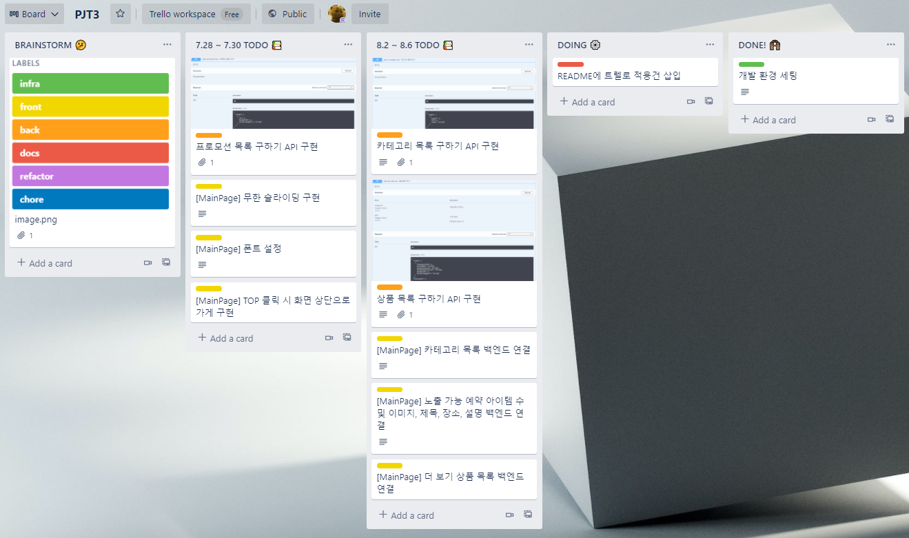

# PJT3. 예약 시스템

## 일정 관리

이번 프로젝트부터는 트렐로를 사용하여 일정관리를 진행한다.

초기 일정은 대분류로 잡고 subTask로 추가할 예정이다.

[8.2 ~ 8.6 TODO📚] 부분에 리팩토링은 새일정으로 넣는다.

* 7.29 일정 상태

* 8.3 일정 상태

<a href="https://trello.com/invite/b/s7hPrEzk/ea484303360596b468773c23f722e6a2/pjt3" style="font-size:24px; font-weight:550; color: #2DB400;">프로젝트 트렐로 보기</a>

# 2021 NTS 인턴쉽 Project

부스트코스 + 깃랩 + 코드리뷰를 통한 공통 프로젝트 8주간 진행

부스트코스 URL: https://www.boostcourse.org/web316

## 부스트 코스

* 웹프로그래밍 기초 ✔

* DB 연결 웹 앱 ✔

* 웹 앱 개발: 예약서비스 🚢

※ 🚢: 진행 중, ✔: 완료

## 깃 플로우

* 웹프로그래밍 기초 Branch
  * PJT.1_dev - 개발 브랜치
  * PJT.1_master - 마지막 MR 후, 태깅해서 제출

 

* DB 연결 웹 앱  Branch
  * PJT.2_dev - 개발 브랜치
  * PJT.2_master - 마지막 MR 후, 태깅해서 제출

 

* 웹 앱 개발: 예약서비스  Branch
  * PJT.3_dev, PJT.4_dev, PJT.5_dev, PJT.6_dev - 개발 브랜치
  * master - 마지막 MR 후, 제출

## 기타 사항

* 1일 1커밋
* 주 2회 미팅
* 코드리뷰 후,  WIKI 작성
