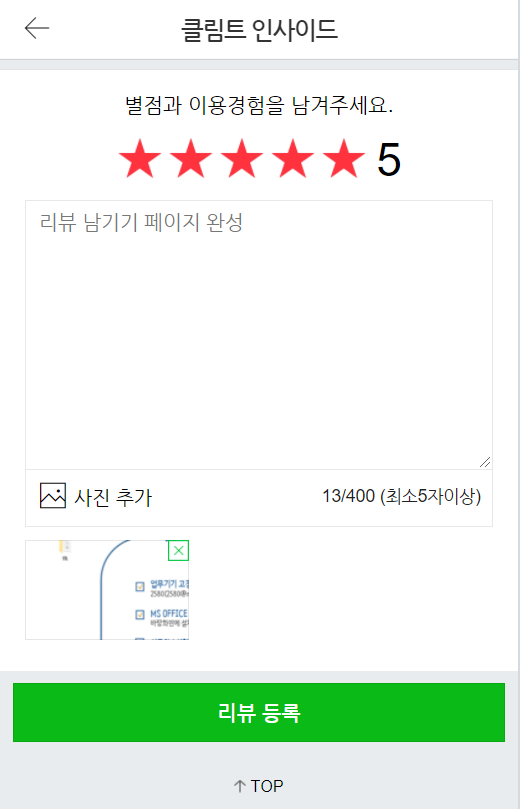

# 예약 시스템

## 일정 관리


<a href="https://trello.com/invite/b/s7hPrEzk/ea484303360596b468773c23f722e6a2/pjt3" style="font-size:24px; font-weight:550; color: #2DB400;">PJT 3 트렐로 보기</a>


<a href="https://trello.com/b/VSSTXIzi/pjt4" style="font-size:24px; font-weight:550; color: #2DB400;">PJT 4 트렐로 보기</a>


<a href="https://trello.com/b/myI6H2k7/pjt5" style="font-size:24px; font-weight:550; color: #2DB400;">PJT 5 트렐로 보기</a>


<a href="https://trello.com/b/NAa1uDLS/pjt6" style="font-size:24px; font-weight:550; color: #2DB400;">PJT 6 트렐로 보기</a>


# PJT6

## FrontEnd

### 스택

* HMTL, CSS, JavaScript

### 툴

* IDE: vsCode, Eclipse

### 개발

리뷰 작성에 관련해서 화면 개발을 진행하였습니다.

* 리뷰 작성 페이지
  * 별점 관련해서 JS를 통해 checked가 있는 곳을 기준으로 앞의 엘리먼트들을 색칠하고 뒤의 엘리먼트들을 색없게 만들었습니다.
  * 이미지 파일을 양 옆으로 맞추기 위해 display를 inline-block으로 지정하였습니다.
  * 별점을 남기지 않거나 최소 글자 수를 못 채우고 리뷰 등록 시, 알림이 뜹니다.
  * 처음 리뷰 작성 가이드는 0글자에서 다른 곳을 클릭할 시, 나타납니다.
  * 이미지는 리뷰 작성 시, 필수사항이 아니게끔 리뷰작성페이지를 구성하였습니다.


## BackEnd

### 스택

* Spring mvc, JDBC, Mysql

### 툴

* IDE: Eclipse
* Web Server: Apache Tomcat

### 개발

리뷰작성에 관련해서 API 개발을 진행하였습니다.

* 리뷰 작성
  * 리뷰 작성 후, 보낸 데이터를 바탕으로 이미지가 있다면 이미지와 함께 저장하고 없다면 코멘트만 저장하게 됩니다.
  * 이미지와 함께 저장 시, 코멘트 저장과 이미지 저장을 먼저 진행한 후, 해당 키값들을 모아서 reservation_user_comment_image의 테이블에 저장하게 됩니다.
* 인터셉터로 로그인의 세션시간이 갱신됩니다.
* 이미지는 로컬에 c:/tmp 폴더에 저장되게 되며, 불러올 때는 다운로드를 통해 진행됩니다.
* 따라서 기본 리뷰 img가 아닌 다른 사람이 작성한 리뷰 img는 현재 볼 수 없습니다. (프로젝트의 스펙으로 인한 오류)
  * 자신이 저장한 리뷰의 이미지는 보기 가능합니다.

### Pages

* 리뷰 작성 페이지




# PJT5

## FrontEnd

### 스택

* HMTL, CSS, JavaScript

### 툴

* IDE: vsCode, Eclipse

### 개발

상품 예약 및 로그인 관련해서 화면 개발을 진행하였습니다.

* 상품 예약내용과 예약하기에 필요한 정보들은 핸들바를 이용하여 API 데이터를 받아와 HTML에 배치하였습니다.
* 상품 예약하기
  * 처음엔 Ajax 통신으로 예약하기를 만들었었는데, PJT 5에서 HiddenFormTag를 배워 새로 리팩토링해봤습니다. (요구사항이라기 보다 하면 좋겠다라고 영상에 나옵니다.)
  * 화면에서 정규식표현을 통해 각 인풋 값의 밸리데이션 체크를 진행합니다.
  * 인풋의 keyup마다 체크와 예약하기 버튼을 누르면 alert로 체크하는 두 가지 체크가 있습니다.
* 예약 현황 받아오기
  * 예약현황을 받아와서 취소 플래그로 취소현황을 파악하고 취소된 예약 건이 아닐 경우 현재 시간보다 높으면 이용완료를 체크하고 아니라면 예약 확정으로 배치합니다.
  * 카운트는 서버에서 바로 받아오지만 취소버튼의 동작에 따라 페이지이동없이 동작하게 됩니다.
  * 예약 취소는 모달창으로 구현되어 있는 것을 JS로 여러 버튼 동작(예, 아니오, 닫기)을 가능하게 하였습니다.
* 로그인 구현
  * 로그인 시 처음엔 이메일을 쿠키에 저장했는데, 쿠키의 용도를 제대로 알지 못해 사용하게 되었습니다.
  * 현재는 세션에 저장하였고 쿠키에 저장되어 있는 세션ID를 통해 서버의 세션에 로그인되어 있는지 확인합니다.
* 추가로 필요없는 주석을 삭제하였고 필요한 경우, 함수를 쓰는 곳이 아닌 구현된 곳에 주석을 달아 놓았습니다.


## BackEnd

### 스택

* Spring mvc, JDBC, Mysql

### 툴

* IDE: Eclipse
* Web Server: Apache Tomcat

### 개발

상품 예약 및 로그인 관련해서 API 개발을 진행하였습니다.

* 상품 예약 API
  * 상품 예약에 관련된 모델들을 재사용할 수 있도록 모델을 합쳤습니다.
  * 상품을 생성할 때, 결제관련 및 각 insert 쿼리마다의 의존성이 있어 @Transactional을 넣었습니다.
* 인터셉터 설정을 통해 로그인 필요 시, 로그인 페이지로 리다이렉트하게 끔 하였습니다.
* 로그인 기능과 로그아웃 API를 작성하였고, 현재는 로그인 기능만 사용됩니다.
  * 로그아웃 기능(요구사항 X)은 추후 PJT6 구현 마친 후에 추가로 작성할 예정입니다.
* 취소 API는 요구사항인 PUT 메서드를 통해 진행되었고, 예약을 삭제하는 것이 아닌 플래그처리를 통해 예약취소를 구현하였습니다.
* 각 예약의 티켓수 totalcount는 `SUM()`  함수와 `*` 연산자, `GROUP BY`를 통해 한 번에 sql 처리하였습니다.
* insert 시, 여러 insert를 한 번에 해야하는 상황이면 batch를 사용하여 부하를 줄였습니다.


### Pages

* 로그인 페이지


* 예약하기 페이지


* 나의 예약 페이지


* 예약 취소 페이지


# PJT4

## FrontEnd

### 스택

* HMTL, CSS, JavaScript

### 툴

* IDE: vsCode, Eclipse

### 개발

상품 상세내용 및 리뷰 관련해서 화면 개발을 진행하였습니다.

* 상품 상세내용은 핸들바를 이용하여 API 데이터를 받아와 HTML에 배치하였습니다.
* 캐러셀 구현
  * 기존의 프로모션 캐러셀은 오른쪽으로만 이동하는 것에 초점을 두어 왼쪽으로 이동이 불가 했습니다.
  * 따라서 상품 캐러셀은 왼쪽으로도 이동할 수 있게끔 캐러셀을 바꾸었고, 프로모션 캐러셀과 통합하여 util 폴더에 js파일로 저장하였습니다.
  * 상품 캐러셀이 움직일 때, 트랜지션이 끝나기전에 이동버튼을 한번 더 누르면 상단에 표시되는 인덱스가 이미지의 인덱스와 불일치하는 경우가 발생했었고, 때문에 트랜지션이 끝난 후, 인덱스 표기를 변경하였습니다.
* 리뷰 구현
  * 리뷰의 경우 하나의 js 파일을 통해 detail 페이지와 review 페이지에서 사용합니다.
  * 파라미터로 각 ajax 요청을 할 주소를 받고, 그 주소를 통해 전체 리뷰를 가져올 것인지, detail 페이지에 표시할 갯수만큼만 가져올 것인지 판단합니다.
* 오시는 길과 상세 설명은 카테고리와 비슷하게 작성하였고, 괜히 이상한 곳으로 이동되는 a 태그들의 주소를 변경하였습니다.
* 추가로 모든 페이지의 top 버튼 클릭 시, 화면 상단으로 이동하는 것을 구현하였습니다.


## BackEnd

### 스택

* Spring mvc, JDBC, Mysql

### 툴

* IDE: Eclipse
* Web Server: Apache Tomcat

### 개발

상품 상세내용 및 리뷰 관련해서 API 개발을 진행하였습니다.

* 리뷰관련 API는 DB 스펙에 따라 reservation으로 따로 패키지를 구성하여 작성하였습니다.
* 상품 상세내용 API는 product 패키지에 작성하였습니다.
* 빈이 2개 생성되는 현상이 발생하여, web.xml부터  config까지 어떻게 빈에 등록되는지 확인하였고, `@configration` 어노테이션을 `excludeFilter`로 설정하여 해결하였습니다.

```java
// ApplicationConfiguration
@ComponentScan(basePackages = {"com.ntscorp.intern"}, useDefaultFilters = true, excludeFilters = {
	@Filter(type = FilterType.ANNOTATION, classes = {Controller.class, Configuration.class})
})

// WebMvcContextConfiguration
@ComponentScan(basePackages = {"com.ntscorp.intern"}, useDefaultFilters = false, includeFilters = {
	@Filter(type = FilterType.ANNOTATION, classes = {Controller.class})
})
```

* Date는 `@JsonFormat`을 이용하여 시간대와 표시될 포맷을 맞췄습니다.
* `ifnull`쿼리를 통해 평균을 구할 때, `null` 값을 `0`값으로 변경하였습니다.

```sql
SELECT COUNT(*) AS total_count, ifnull(AVG(cmt.score), 0) AS average_score
FROM display_info AS dpl
JOIN reservation_user_comment AS cmt ON dpl.product_id = cmt.product_id
WHERE dpl.id = :displayInfoId;
```

* 최종적으로 ReviewController와 DetailController를 통해 FrontEnd와 통신합니다.


## Pages

* 상품 상세 내용 페이지 상단

  

* 상품 상세 내용 페이지 하단

  

  

* 리뷰 페이지

  


# PJT3

## FrontEnd

### 스택

* HMTL, CSS, JavaScript

### 툴

* IDE: vsCode, Eclipse

### 개발

vsCode에서 JavaScript(이하 JS) 파일을 작성하고 Eclipse에서 HTML, CSS을 작성하였습니다.

인덴트는 기본설정이 4라서 4를 따랐고, CSS와 JS는 분리하여 사용하였습니다.

기본적인 틀을 바탕으로 템플릿팅을 사용하여 화면을 구성하였습니다.

데이터는 JS로 ajax 통신을 이용하여 받아왔습니다.

요구사항 확인 후, 트렐로에 반영시켰고 트렐로 일정대로 진행하였습니다.

* 프로모션 부분
  * ajax통신을 이용하여 프로모션 이미지를 불러왔습니다.
  * 큐방식을 이용하여 캐러셀(무한 슬라이더)을 만들었습니다. 
* 카테고리 부분
  * UI 부분이 조금 튀어나가는 부분이 있어 CSS를 고쳤습니다.
  * 전체리스트 항목은 놔두고 다른 카테고리를 ajax를 통해 데이터를 불러왔습니다.
* 상품리스트 부분
  * 각 카테고리별 상품을 순서에 맞게 4개를 ajax로 불러왔습니다.
  * 상품 전시하는 부분에서 `%2` 연산을 통해 양 쪽 `ul`에 배치하였습니다.
* 더보기 부분
  * 더보기를 누르면 각 카테고리에 맞는 데이터가 양 쪽 `ul`에 2개씩 배치됩니다.
    * ex) 받아온 상품이 3개일때,
      * 순서에 맞게 왼쪽 `ul`태그부터 상품이 (2, 1) 형식으로 배치됩니다
    * ex) 받아온 상품이 2개일때,
      * 순서에 맞게 왼쪽 `ul`태그부터 상품이 (1, 1) 형식으로 배치됩니다.
  * 더 이상 불러올 데이터가 없다면 더보기는 사라집니다.
* TOP 부분
  * 링크를 통해 `#`이 붙는 경우가 top기능의 부차적인 에러라고 생각해서 js를 통해 주소창에 `#`이 안 붙어도 화면상단으로 올라가게 만들었습니다.
* Header 부분
  * 왼쪽 예약 로고에 대한 링크를 없앴습니다.
  * 예약확인시 비회원 로그인을 하면 1시간동안 쿠키가 지속되게 만들었습니다.
  * 쿠키가 지속되는 동안 예약확인 버튼 대신 현재 비회원의 이메일이 표시됩니다.


추가적으로 JS 자체를 분리하여 가독성을 높였고, 분리할 수 있는 함수들은 분리시켰습니다.


## BackEnd

### 스택

* Spring mvc, JDBC, Mysql

### 툴

* IDE: Eclipse
* Web Server: Apache Tomcat

### 개발

Eclipse를 통해 작성하였고, 루트 패키지 명은 com.ntscorp.intern으로 지었습니다.

기능별로 product 패키지와 reservation 패키지 그리고 config 패키지로 나누었습니다.

PJT 3의 경우reservation 패키지는 사용하지 않습니다.

각 패키지에서 레이어드 아키텍처에 따라 controller / model /  repository / service 패키지로 구분하였습니다.


##### controller 

`@RestController`를 통해 API 형식을 지원합니다.

클라이언트가 원하는 데이터를 여러 서비스에서 받아 `ResponseEntity`를 json형태로 반환합니다.


##### model 

데이터베이스의 테이블 모델입니다.

해당 모델을 통해 데이터베이스에서 받는 결과를 사용합니다.


##### repository 

해당 패키지에서 레파지토리가 사용할 쿼리를 저장합니다.

저장된 쿼리를 통해 데이터베이스와 연결하고 데이터를 받아옵니다.


##### service 

서비스는 레파지토리에서 받은 데이터를 가공하거나 기능 구현에 대한 여러 작업을 거쳐 컨트롤러에 전달합니다.


이 외에도 DB properties를 application.properties로 따로 사용하였고,

컴포넌트 스캔을 필터링하여 필요한 컴포넌트만 가져올 수 있도록 하였습니다.

slf4j 로거를 사용하여 에러를 콘솔에 로깅하였고,

컨트롤러 어드바이스를 사용하여 에러 핸들링을 하였습니다.


## Pages

### 메인화면


### 비회원로그인


# 2021 NTS 인턴쉽 Project

부스트코스 + 깃랩 + 코드리뷰를 통한 공통 프로젝트 8주간 진행

부스트코스 URL: https://www.boostcourse.org/web316


## 부스트 코스

* 웹프로그래밍 기초 ✔

* DB 연결 웹 앱 ✔

* 웹 앱 개발: 예약서비스 🚢


※ 🚢: 진행 중, ✔: 완료


## 깃 플로우

* 웹프로그래밍 기초 Branch
  * PJT.1_dev - 개발 브랜치
  * PJT.1_master - 마지막 MR 후, 태깅해서 제출

<br>

* DB 연결 웹 앱  Branch
  * PJT.2_dev - 개발 브랜치
  * PJT.2_master - 마지막 MR 후, 태깅해서 제출

<br>

* 웹 앱 개발: 예약서비스  Branch
  * PJT.3_dev, PJT.4_dev, PJT.5_dev, PJT.6_dev - 개발 브랜치
  * master - 마지막 MR 후, 제출


## 기타 사항

* 1일 1커밋
* 주 2회 미팅
* 코드리뷰 후,  WIKI 작성
